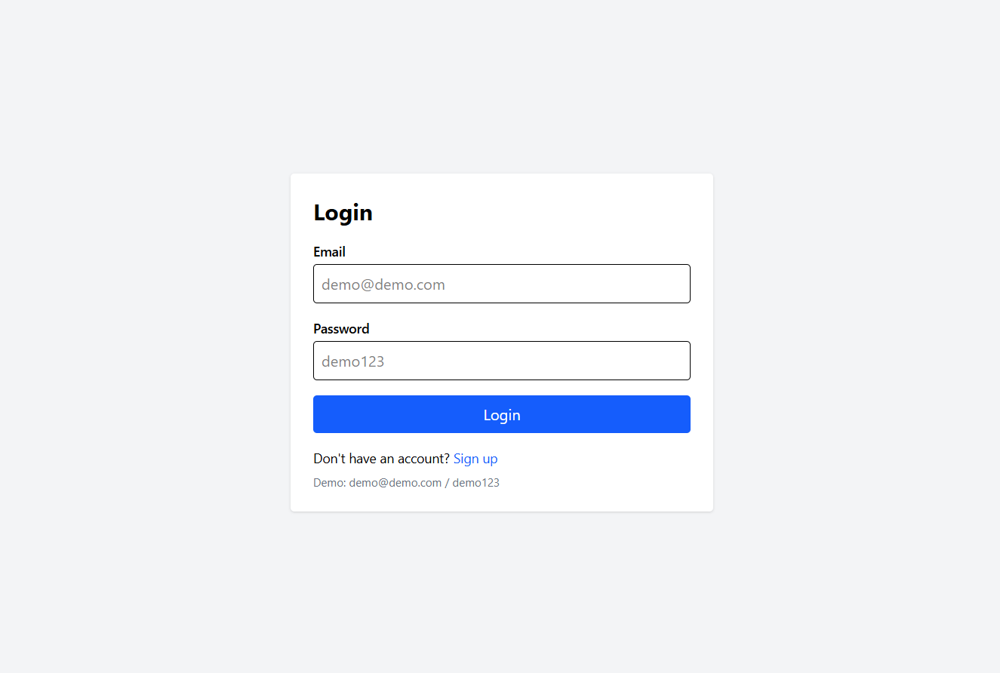
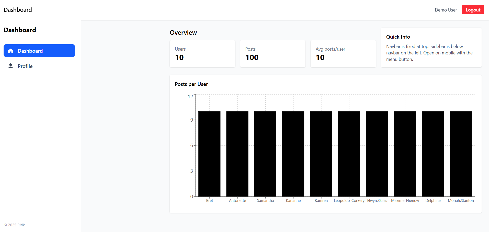
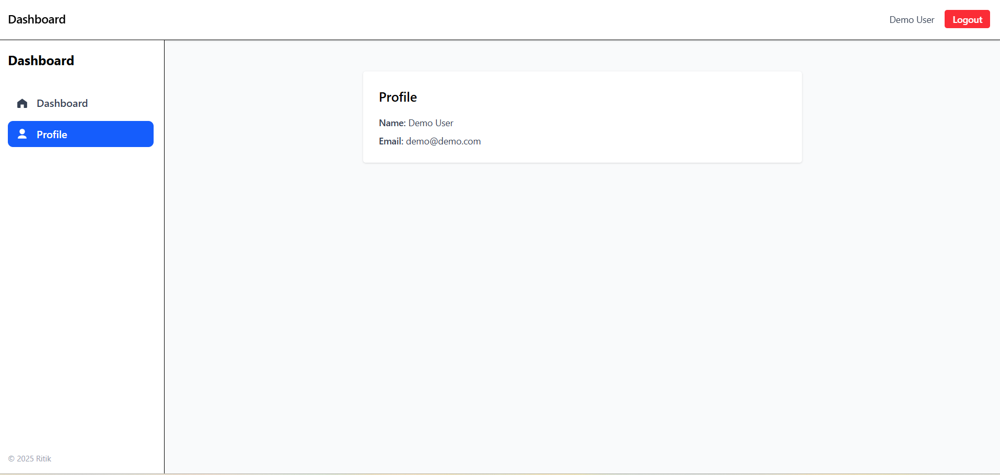
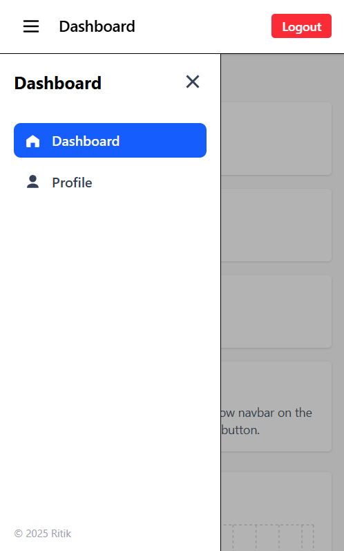

# React + Vite

This template provides a minimal setup to get React working in Vite with HMR and some ESLint rules.

Currently, two official plugins are available:

- [@vitejs/plugin-react](https://github.com/vitejs/vite-plugin-react/blob/main/packages/plugin-react) uses [Babel](https://babeljs.io/) for Fast Refresh
- [@vitejs/plugin-react-swc](https://github.com/vitejs/vite-plugin-react/blob/main/packages/plugin-react-swc) uses [SWC](https://swc.rs/) for Fast Refresh

## Expanding the ESLint configuration

If you are developing a production application, we recommend using TypeScript with type-aware lint rules enabled. Check out the [TS template](https://github.com/vitejs/vite/tree/main/packages/create-vite/template-react-ts) for information on how to integrate TypeScript and [`typescript-eslint`](https://typescript-eslint.io) in your project.
 
---

# 📊 React Dashboard Application

This project is a **responsive frontend dashboard** built with **React + Vite + TailwindCSS**.  
It includes **Login/Signup authentication**, a **Dashboard with charts & cards**, a **Profile page fetching user details**, and a **fully responsive sidebar with topbar**.  

---

## 🚀 Features
- 🔑 Login / Signup with validation  
- 📊 Dashboard with sidebar, topbar, cards, and charts  
- 👤 Profile page (data from API)  
- 📱 Fully responsive (desktop, tablet, mobile)  
- 🔔 Notifications with React Toastify  

---

## ⚙️ Installation & Setup

```bash
# Clone repo
git clone https://github.com/your-username/your-repo.git
cd your-repo

# Install dependencies
npm install

# Run development server
npm run dev

## 📸 Screenshots

### Login  
  

### Dashboard  
  

### Profile  
  

### Mobile Sidebar  
 
